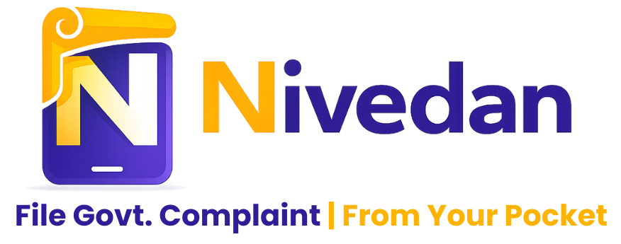

<p align="center">
  
</p>

<h1 align="center">Nivedan</h1>

<p align="center">
  <em>AI-powered civic complaint assistant for Indian citizens — file government complaints in your own language.</em>
</p>

<p align="center">
  
  
  
  
</p>

---

Users describe their problem by voice or text. The AI agent (powered by Sarvam AI) holds a natural conversation, collects all required details, fills the government form, generates a signed PDF, and submits it to the portal — entirely in the user's language.

**Target users:** Low-literacy, vernacular-language speakers across India  
**Supported languages:** English, Hindi, Telugu, Tamil, Kannada, Malayalam (+ Bengali, Marathi, Gujarati, Punjabi via backend)

---

## Live Deployment

| Service | URL |
|---------|-----|
| Backend API | https://nivedan.onrender.com |
| Mock Govt Portal | https://nidean-govt-mock-portal.onrender.com/portal/dashboard |

> Both services run on Render's free tier. Expect a **15–30 second cold start** after inactivity.

---

## Changelog

<details>
<summary><strong>v2.2.2</strong> — Chat Continuity & Conversation History</summary>

- Users can now resume any in-progress case directly from the dashboard
- Past conversation messages are fully restored on resume (no re-asking from scratch)
- Submitted cases open in read-only view with full history visible
- Backend `/agent/resume/<id>` endpoint returns cleaned history without LLM call or history reset
- Fixed greeting message now persisted to `agent_history` so it appears on resume

</details>

<details>
<summary><strong>v2.2.1</strong> — Error Handling Audit</summary>

- Reviewed and hardened all API error paths across backend routes
- Global JSON error handlers prevent HTML 500 responses reaching the mobile client
- `$or` user_id query guards handle both ObjectId and legacy string formats
- Frontend surfaces actual server error messages instead of generic fallback text

</details>

<details>
<summary><strong>v2.2.0</strong> — Thinking Strip Redesign & Agentic CoT</summary>

- Thinking strip and "Thought process" card now stretch full screen width (no more narrow bubble)
- Chain-of-thought steps revealed one-by-one with fade-in animation
- Parallel `/agent/thinking` call generates model-specific steps shown while response is held back
- Minimum 3.5s thinking display ensures users see the AI reasoning before the reply appears

</details>

<details>
<summary><strong>v2.1.0</strong> — Web UI Overhaul & Nivedan Branding</summary>

- App renamed Nivedan across all surfaces
- Login/Register: split-screen layout with floating illustration
- Dashboard: 3-column layout with charts, notifications, and carousel
- Profile page created with gradient hero card matching mobile design
- Mobile: LinearGradient profile hero, hamburger drawer with real-time case refresh

</details>

<details>
<summary><strong>v2.0.0</strong> — Multilingual UI & Mobile Polish</summary>

- Full i18n system — 6 languages, ~50 string keys, instant re-render on language switch
- Dark/light theme toggle persisted across sessions
- Delete pending complaints with owner + status guards
- Safe area fix: tab bar no longer overlaps home indicator

</details>

---

## Architecture

```
civicflow/
├── backend/        Flask REST API           — port 5000  (uv managed, Python 3.11+)
├── mock_portal/    Mock Government Portal   — port 5001  (uv managed)
├── mobile/         React Native + Expo 54   — citizen app
└── web/            React 18 + Vite          — web dashboard (port 5173)
```

All four components run independently and communicate over HTTP. MongoDB is the shared database.

---

## Tech Stack

| Layer | Technology |
|-------|-----------|
| Mobile | React Native 0.81.5 + Expo SDK 54, expo-router |
| Web | React 19 + Vite 7 + TypeScript, Tailwind CDN |
| Backend | Flask 3, Python 3.11+, `uv` package manager |
| Mock Portal | Flask 3, port 5001 |
| Database | MongoDB 7+, raw pymongo (no ORM) |
| AI | Sarvam AI `sarvam-m` via `sarvamai` SDK |
| Auth | JWT HS256, `pyjwt>=2.8`, 30-day expiry |
| PDF | fpdf2 + pypdf, server-side only |
| 3D Web UI | Three.js 0.183 + React Three Fiber |

---

## Prerequisites

| Tool | Version |
|------|---------|
| Python | 3.11+ |
| uv | latest — `pip install uv` |
| Node.js | 18+ |
| MongoDB | 7+ |
| Expo Go | latest (App Store / Play Store) |

---

## Setup

### Backend
```bash
cd civicflow/backend
cp .env.example .env      # fill in JWT_SECRET and SARVAM_API_KEY
uv sync
```

### Mock Portal
```bash
cd civicflow/mock_portal
uv sync
```

### Mobile
```bash
cd civicflow/mobile
npm install
```

### Web
```bash
cd civicflow/web
npm install
```

---

## Environment Variables

### `civicflow/backend/.env` — local dev
```env
MONGO_URI=mongodb://localhost:27017/civicflow
JWT_SECRET=replace-with-a-long-random-string
SARVAM_API_KEY=your-sarvam-api-key-here
MOCK_PORTAL_URL=http://localhost:5001
```

### Render (production)
```env
MONGO_URI=<your-mongo-atlas-uri>
JWT_SECRET=<generate with: python -c "import secrets; print(secrets.token_hex(32))">
SARVAM_API_KEY=<from-sarvam-dashboard>
MOCK_PORTAL_URL=https://nidean-govt-mock-portal.onrender.com
```

### `civicflow/mobile/.env`
```env
# Local dev — get LAN IP via: ipconfig → Wi-Fi IPv4
EXPO_PUBLIC_API_URL=http://<YOUR_LAN_IP>:5000

# Production
EXPO_PUBLIC_API_URL=https://nivedan.onrender.com
```

> Run `npx expo start --clear` after changing the mobile env.

---

## Running Locally

Start MongoDB first, then:

```bash
# Terminal 1 — Backend
cd civicflow/backend && uv run python app.py

# Terminal 2 — Mock Portal
cd civicflow/mock_portal && uv run python portal_app.py

# Terminal 3 — Web
cd civicflow/web && npm run dev

# Terminal 4 — Mobile
cd civicflow/mobile && npx expo start --clear
```

| Service | URL |
|---------|-----|
| Backend API | http://localhost:5000 |
| Mock Govt Portal | http://localhost:5001 |
| Web Dashboard | http://localhost:5173 |
| Mobile | Scan QR with Expo Go / press `a` (Android) / `i` (iOS) |

---

## Agent Flow

```
CHAT → SHOW_BLANK_FORM → COLLECT_FIELDS → COLLECT_DOCS → PREVIEW → SUBMITTED
                                               ↑
                               (sub-stages: signature → documents)
```

| Stage | What happens |
|-------|-------------|
| CHAT | AI greets user, understands the problem in their language |
| SHOW_BLANK_FORM | Official blank form PDF shown for reference |
| COLLECT_FIELDS | AI asks one question at a time, extracts structured data |
| COLLECT_DOCS | Requests digital signature, then supporting documents |
| PREVIEW | Filled PDF shown for user confirmation |
| SUBMITTED | PDF posted to portal; push notification on status change |
| REJECTED | AI auto-corrects form fields and regenerates |

---

## Complaint Categories

| Domain | Subcategory | Authority |
|--------|-------------|-----------|
| Labor Issues | Salary Not Paid | Labour Commissioner |
| Labor Issues | Wrongful Termination | Labour Commissioner |
| Labor Issues | Workplace Harassment | Labour Commissioner / ICC |
| Police & Criminal | FIR Not Registered | Superintendent of Police |
| Police & Criminal | Police Misconduct | SP / State HRC |
| Consumer | Defective Product | Consumer Forum |
| Cyber / Fraud | Online Scam | Cyber Crime Cell |

---

## Key API Endpoints

```
POST  /auth/register          { name, email, password, phone, preferred_language }
POST  /auth/login             { email, password }
GET   /auth/me

POST  /complaints/create      { category, subcategory, form_data } → { _id }
DELETE /complaints/<id>       owner-only, pending-only
POST  /complaints/<id>/upload-doc   { type, file_base64, filename, mime_type }
PATCH /complaints/<id>/status       { status }

POST  /agent/message          { complaint_id, message }   — send message="" for greeting
GET   /agent/resume/<id>      — resume session, returns cleaned history + current state

GET   /notifications/mine?all=1
POST  /notifications/read/all
POST  /users/push_token       { token }
POST  /webhooks/portal        (no JWT — called by mock portal)
```

---

## Mock Portal

The mock portal simulates the government's complaint intake system.

- **Dashboard** — Auto-refreshes every 15s; shows all submissions with status counts
- **Approve / Fail** — Manually advance or reject a submission during demo
- **Webhooks** — Each action fires `POST /webhooks/portal` → triggers push notifications on the mobile app

---

## Development Rules

1. **`uv` only** — `uv add <pkg>`, `uv sync`, `uv run python`. Never `pip install`.
2. **No ORM** — Raw pymongo everywhere.
3. **`load_dotenv()` first** — Must be the first call in `app.py`.
4. **PDF server-side only** — fpdf2 runs on the backend, never on the client.
5. **No Redux / Zustand** — Local state + React context only.
6. **`complaint._id`** — `/complaints/create` returns `_id`. Never `.complaint_id`.
7. **Flask `host="0.0.0.0"`** — Required for mobile on LAN.
8. **CORS** — Must explicitly include `DELETE` in the allowed methods.

---

## Project Status

| Phase | Description | Status |
|-------|-------------|--------|
| 0–9 | Scaffold, auth, portal, agent, PDF, viewer, notifications, signature+docs | ✅ |
| 10 | Multilingual UI (i18n), mobile polish, animations | ✅ |
| 11 | Web UI overhaul, Nivedan branding | ✅ |
| 12 | CoT thinking strip, error hardening, chat continuity | ✅ |

---

*© 2026 Nivedan. All rights reserved.*
